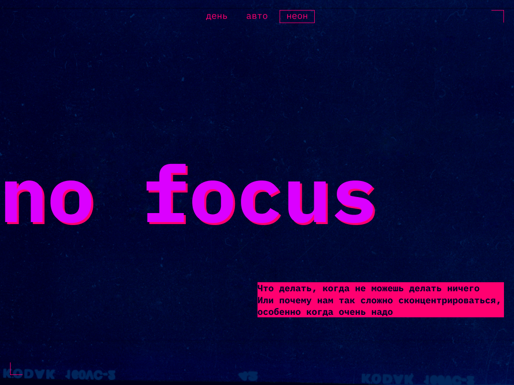
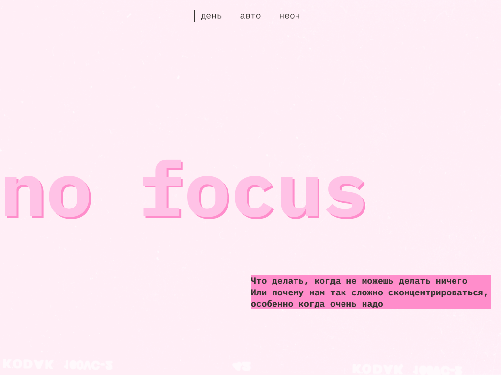

# 🎯 Сложно сосредоточиться

Адаптивная веб-страница с советами о том, как улучшить концентрацию внимания и справиться с отвлекающими факторами в современном мире.

## 🖼️ Превью дизайна

### Темная тема


### Светлая тема


## 🌐 Ссылки

- **[Лайв превью](https://slozhno-sosredotochitsya-fd-seven.vercel.app)** - посмотреть проект в действии
- **[Автор проекта](https://github.com/Sergei-Popov)** - GitHub профиль разработчика

## 📚 О проекте

Этот проект выполнен в рамках проектной работы на курсе **"Фулстек разработчик"** (3-й спринт) от Яндекс Практикум.

Проект представляет собой информационную страницу о проблемах концентрации внимания в современном мире, причинах рассеянности и практических советах по улучшению фокусировки.

## ✨ Функционал

### 🎨 Переключение тем
- **Светлая тема** - для комфортного чтения днем
- **Темная тема (Неон)** - для работы в темное время суток
- **Автоматическая тема** - следует системным настройкам пользователя
- Сохранение выбранной темы в localStorage

### 📱 Адаптивный дизайн
- **Мобильные устройства** (от 375px)
- **Планшеты** (от 768px) 
- **Десктоп** (от 1024px)

### 🎯 Контент
- Научно обоснованная информация о проблемах концентрации
- Практические советы по улучшению фокуса
- Галерея с атмосферными изображениями
- Интерактивные элементы с hover-эффектами

## 🛠 Технологии

### Frontend
- **HTML5** - семантическая разметка
- **CSS3** - современные возможности стилизации
  - CSS Grid & Flexbox для компоновки
  - CSS Custom Properties (переменные)
  - Media queries для адаптивности
  - Логические CSS-свойства
- **JavaScript (ES6+)** - интерактивность
  - Управление темами
  - DOM-манипуляции
  - LocalStorage API

### Шрифты
- **IBM Plex Mono** - моноширинный шрифт для технического стиля

### Инструменты разработки
- **Prettier** - форматирование кода
- **Stylelint** - линтинг CSS с расширенной конфигурацией
- **Git** - система контроля версий

## 📁 Структура проекта

```
slozhno-sosredotochitsya-fd/
├── index.html              # Главная страница
├── package.json            # Зависимости и скрипты
├── stylelint.config.js     # Конфигурация Stylelint
├── design/                 # Макеты дизайна
│   ├── pc-dark.png        # Десктоп темная тема
│   ├── pc-light.png       # Десктоп светлая тема
│   ├── tablet-dark.png    # Планшет темная тема
│   ├── tablet-light.png   # Планшет светлая тема
│   ├── mobile-dark.png    # Мобильная темная тема
│   └── mobile-light.png   # Мобильная светлая тема
├── fonts/                  # Шрифты
│   ├── fonts.css
│   ├── IBMPlexMono-Bold.woff
│   └── IBMPlexMono-Regular.woff
├── images/                 # Изображения
│   ├── books.png
│   ├── cover-image-dark.png
│   ├── cover-image-light.png
│   ├── favicon.ico
│   ├── favicon.svg
│   ├── ice-cream.png
│   ├── mobile-icon.png
│   ├── street.png
│   ├── sunset.png
│   └── tape.png
├── scripts/                # JavaScript
│   └── script.js
└── styles/                 # Стили
    ├── dark.css           # Темная тема
    ├── globals.css        # Глобальные стили
    ├── light.css          # Светлая тема
    ├── style.css          # Основные стили
    └── variables.css      # CSS-переменные
```

## 🚀 Установка и запуск

### Клонирование репозитория
```bash
git clone https://github.com/Sergei-Popov/slozhno-sosredotochitsya-fd.git
cd slozhno-sosredotochitsya-fd
```

### Установка зависимостей
```bash
npm install
```

### Команды для разработки

```bash
# Проверка форматирования кода
npm run check

# Автоматическое форматирование
npm run format

# Линтинг CSS
npm run lint

# Автоисправление CSS
npm run lintfix

# Полная проверка (форматирование + линтинг)
npm run checkAll

# Полное исправление (форматирование + автоисправление CSS)
npm run fixAll
```

### Просмотр проекта
Откройте файл `index.html` в браузере или используйте любой локальный сервер:

```bash
# Пример с Live Server (VS Code extension)
# или Python
python -m http.server 8000

# или Node.js
npx http-server
```

## 🎨 Особенности дизайна

### Цветовая схема
- **Темная тема**: неоновые акценты на темном фоне
- **Светлая тема**: мягкие пастельные тона
- **Декоративные элементы**: углы с рамками, индикатор REC

### Типографика
- Моноширинный шрифт IBM Plex Mono
- Адаптивные размеры с помощью clamp()
- Высота строки 130% для удобочитаемости

### Интерактивность
- Плавные hover-эффекты
- Focus-состояния для доступности
- Анимированные переходы между темами

## 📱 Поддерживаемые браузеры

- Chrome 88+
- Firefox 87+
- Safari 14+
- Edge 88+

## 📄 Лицензия

ISC License - проект создан в образовательных целях.

---

**Автор:** [Сергей Попов](https://github.com/Sergei-Popov)  
**Курс:** Яндекс Практикум - "Фулстек разработчик" (3-й спринт)
